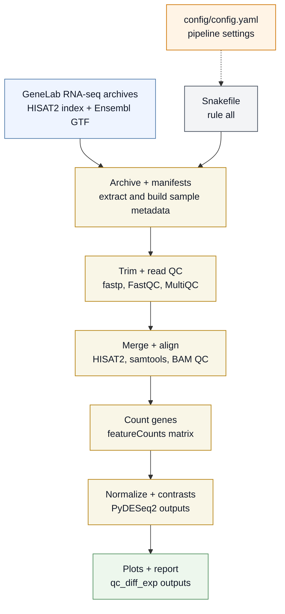

### Rodent Research-1 CASIS experiment, microgravity-associated muscle wasting.
- OSD-47 Mouse liver transcriptomic, proteomic, epigenomic and histology data

[Data source](https://osdr.nasa.gov/bio/repo/data/studies/OSD-47)

- **FLT**: Dissected on orbit 21/22 days after launch
- **GC**: Age-matched Ground Controls
- **BSL**: Basal controls (euthanized at time of launch)

## Snakemake Pipeline Bulk RNA-seq

### Example volcano plots from normalized counts (Bulk RNA-seq):

## Proteomics

1. `.raw` $\rightarrow$ `mzML`
2. `mzML` + [FragPipe](https://fragpipe.nesvilab.org/) $\rightarrow$ quantitative proteomics analyses at different resolutions (e.g., gene-leve, protein-level)

GC_Rep1 $\rightarrow$ driving large part of protein abundance structure. Within-group CG heterogeneity is high $\rightarrow$ caution

Top PC1 protein loadings from centered SVD PCA on the complete-case protein abundance matrix. Positive loadings indicate proteins contributing most strongly to samples on the positive side of PC1.

| Gene | Protein | PC1 loading | abs loading |
| --- | --- | ---: | ---: |
| Mb | ENSMUSP00000019037.9 | 0.1452 | 0.1452 |
| Mylpf | ENSMUSP00000032910.7 | 0.1389 | 0.1389 |
| Cryab | ENSMUSP00000034562.8 | 0.1339 | 0.1339 |
| Tnnt1 | ENSMUSP00000071704.7 | 0.1324 | 0.1324 |
| Chgb | ENSMUSP00000028826.4 | 0.1300 | 0.1300 |
| Tnni2 | ENSMUSP00000101591.2 | 0.1292 | 0.1292 |
| Myl3 | ENSMUSP00000078715.8 | 0.1286 | 0.1286 |
| Ckm | ENSMUSP00000146972.2 | 0.1257 | 0.1257 |
| Myl1 | ENSMUSP00000112861.2 | 0.1251 | 0.1251 |
| Hsd3b1 | ENSMUSP00000029465.8 | 0.1250 | 0.1250 |

Dominated by muscle/contractile proteins. 