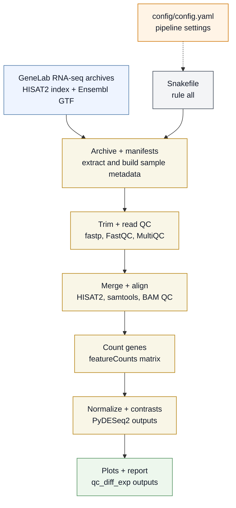
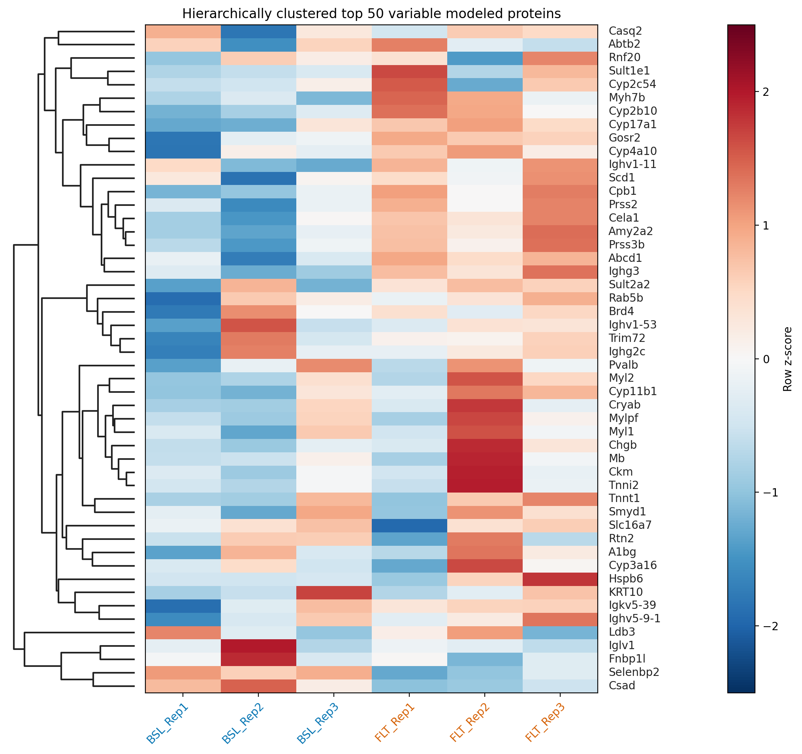

### Rodent Research-1 CASIS experiment, microgravity-associated muscle wasting.
- OSD-47 Mouse liver transcriptomic, proteomic, epigenomic and histology data

[Data source](https://osdr.nasa.gov/bio/repo/data/studies/OSD-47)

- **FLT**: Dissected on orbit 21/22 days after launch
- **GC**: Age-matched Ground Controls
- **BSL**: Basal controls (euthanized at time of launch)

## Snakemake Pipeline Bulk RNA-seq

### Example volcano plots from normalized counts (Bulk RNA-seq):

## Proteomics

1. `.raw` $\rightarrow$ `mzML`
2. `mzML` + [FragPipe](https://fragpipe.nesvilab.org/) $\rightarrow$ quantitative proteomics analyses at different resolutions (e.g., gene-leve, protein-level)

Sample-level tissue-marker QC scores (mean per-gene z-scores across muscle and liver marker panels):

| sample | liver | muscle | muscle_minus_liver |
| --- | ---: | ---: | ---: |
| BSL_Rep1 | -0.843 | -0.636 | 0.208 |
| BSL_Rep2 | -0.739 | -0.633 | 0.106 |
| BSL_Rep3 | 0.079 | -0.437 | -0.516 |
| FLT_Rep1 | 0.852 | -0.572 | -1.423 |
| FLT_Rep2 | -0.128 | 0.034 | 0.162 |
| FLT_Rep3 | 0.369 | -0.431 | -0.800 |
| GC_Rep1 | -0.301 | 2.371 | 2.672 |
| GC_Rep2 | 0.439 | -0.350 | -0.789 |
| GC_Rep3 | 0.273 | 0.654 | 0.380 |

* GC_Rep1 possibly contaminated with muscle tissue
* Exclude all GC_rep for this run

