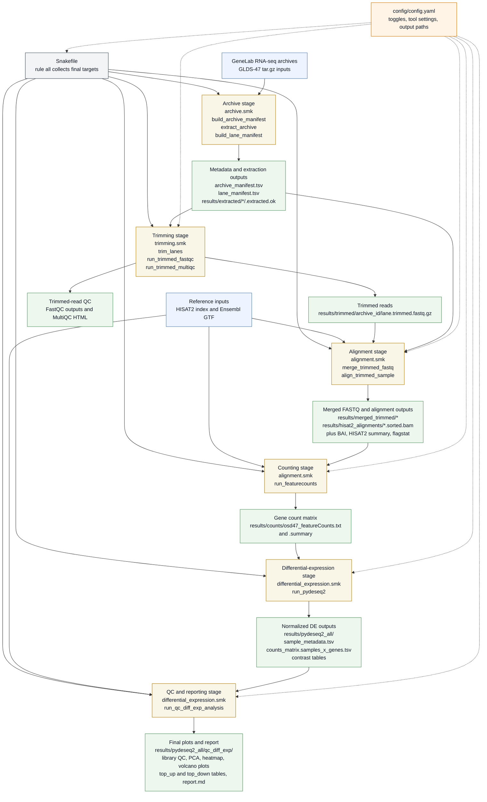

### Rodent Research-1 CASIS experiment, microgravity-associated muscle wasting.
- OSD-47 Mouse liver transcriptomic, proteomic, epigenomic and histology data

[Data source](https://osdr.nasa.gov/bio/repo/data/studies/OSD-47)

- **FLT**: Dissected on orbit 21/22 days after launch
- **GC**: Age-matched Ground Controls
- **BC**: Basal controls (euthanized at time of launch)

### Snakemake Pipeline

### Examples volcano plots from normalized data

