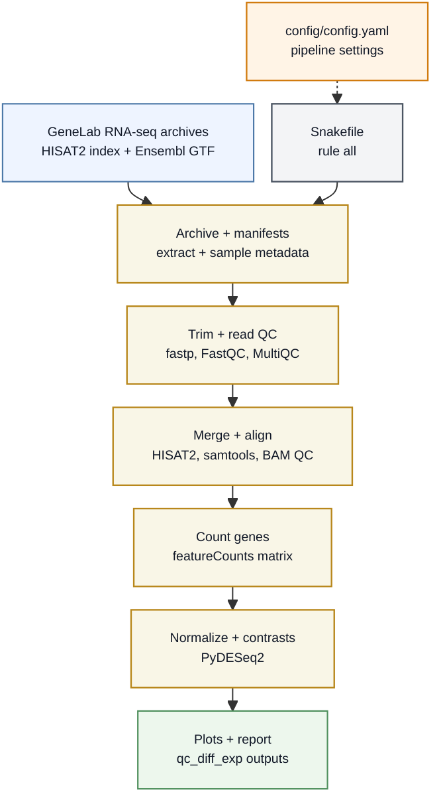
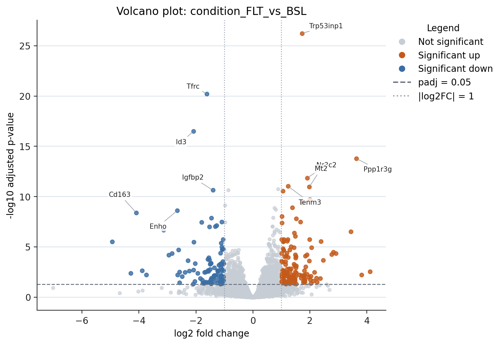
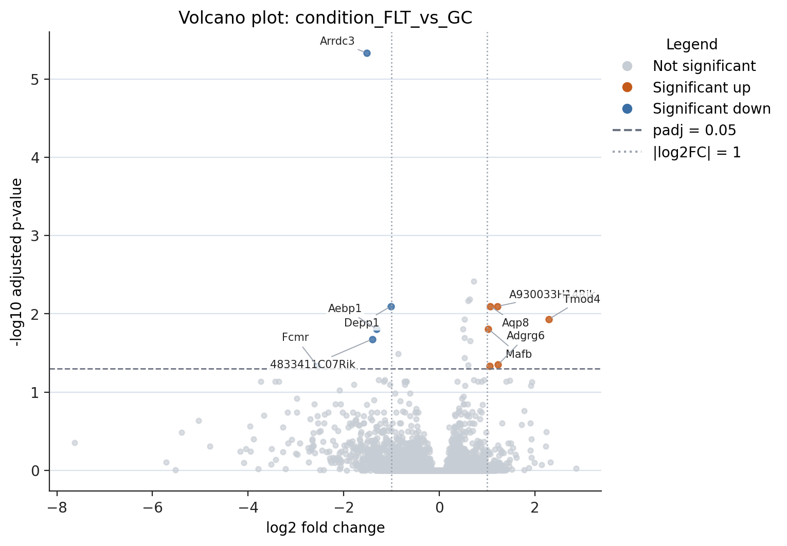
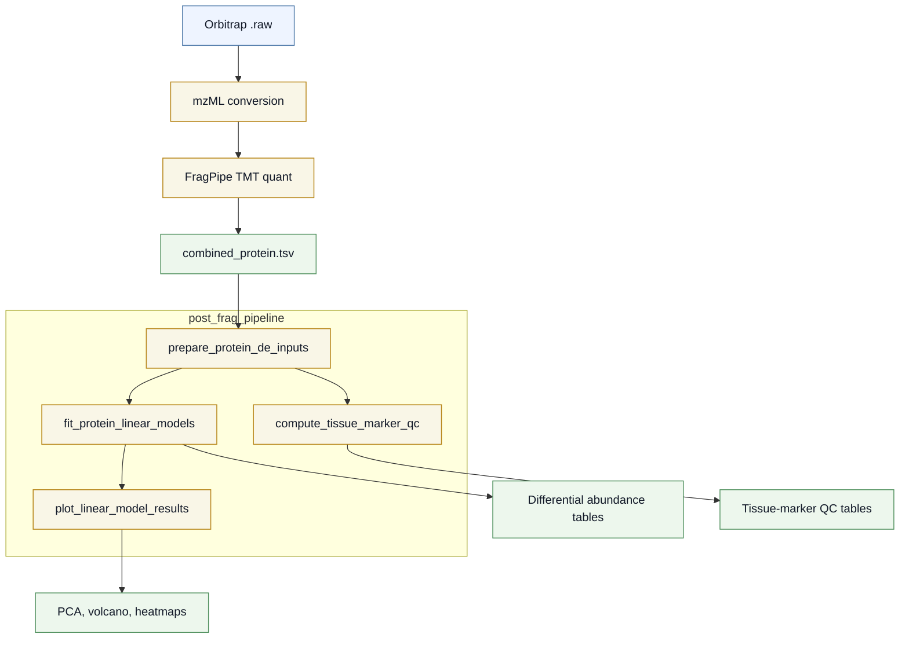
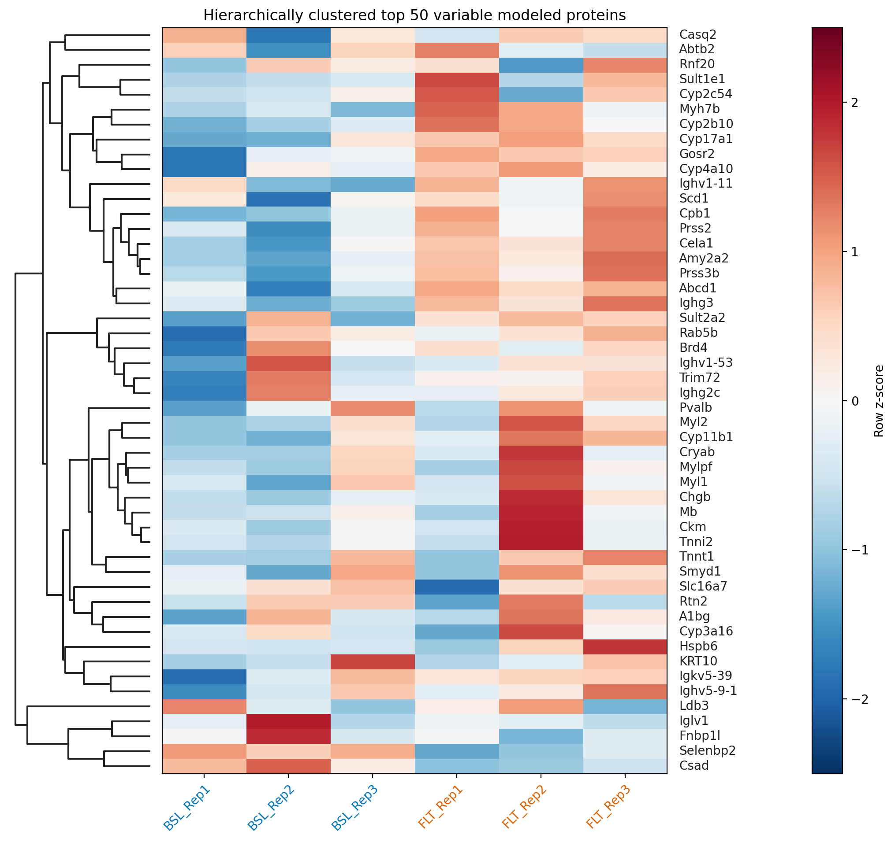

### Rodent Research-1 CASIS experiment, microgravity-associated muscle wasting.
- OSD-47 Mouse liver transcriptomic, proteomic, epigenomic and histology data

[Data source](https://osdr.nasa.gov/bio/repo/data/studies/OSD-47)

- **FLT**: Dissected on orbit 21/22 days after launch
- **GC**: Age-matched Ground Controls
- **BSL**: Basal controls (euthanized at time of launch)

## Snakemake Pipeline Bulk RNA-seq


```mermaid
%%{init: {'themeVariables': {'fontSize': '10px'}, 'flowchart': {'nodeSpacing': 14, 'rankSpacing': 18, 'diagramPadding': 2}}}%%
flowchart TD
	classDef control fill:#F3F4F6,stroke:#4B5563,color:#111827,stroke-width:1.2px;
	classDef config fill:#FFF4E6,stroke:#D17B0F,color:#111827,stroke-width:1.2px;
	classDef input fill:#EEF4FF,stroke:#4C78A8,color:#111827,stroke-width:1.1px;
	classDef stage fill:#F9F6E7,stroke:#B8871B,color:#111827,stroke-width:1.2px;
	classDef output fill:#EDF7ED,stroke:#4E8F5C,color:#111827,stroke-width:1.1px;

	config[config/config.yaml<br/>pipeline settings]:::config -.-> snakefile[Snakefile<br/>rule all]:::control
	input[GeneLab RNA-seq archives<br/>HISAT2 index + Ensembl GTF]:::input --> archive[Archive + manifests<br/>extract + sample metadata]:::stage
	archive --> trim[Trim + read QC<br/>fastp, FastQC, MultiQC]:::stage --> align[Merge + align<br/>HISAT2, samtools, BAM QC]:::stage
	align --> counts[Count genes<br/>featureCounts matrix]:::stage --> de[Normalize + contrasts<br/>PyDESeq2]:::stage
	de --> report[Plots + report<br/>qc_diff_exp outputs]:::output
	snakefile --> archive
```

`featureCounts` undercounts genes with multiple isoforms due to its strict deterministic handling of ambigous reads, in contrast to *transcript-aware* quantifiers (Salmon/Kallisto - use probabilistic Expectation-Maximixation (EM) algorithms).

So if a read overlaps more than one meta-feature, the algorithm flags it as ambiguous and discards it entirely. For isoform-laden genes this triggers undercounting through: 

1. Improper parameter grouping (use of `-g transcript_id`) instead of `g gene_id` in the GTF attributes. $\rightarrow$ `featureCounts` configured to aggregate by `gene_id` then reads on shared exons of the same gene are merged into a single inion-exon and counted once. 
2. Genes with high isoform complexity possess expansive and intricate genomic architectures. 
   - If read aligns to an exon that physically overlaps a feature belonging to an entirely different `gene_id`, `featureCounts` discards read because it cannot definitely assign it to a single gene.
3. Isoform-laden fenes are frequently part of [paralogous gene](https://www.reddit.com/r/explainlikeimfive/comments/12d21n/explain_like_im_5_what_are_orthologous_and/) families that share significant sequence homology across the genome. 

- So `featureCounts` `-g gene_id` will still discard reads: inter-gene overlaps and/or multi-mapping reads 

| Characteristic | `featureCounts` (Alignment-based) | Kallisto / Salmon (Alignment-free) |
| :--- | :--- | :--- |
| **Primary Use Case** | Gene-level expression, variant calling, non-RNA seq | Transcript/Isoform-level expression |
| **Input Requirements** | Aligned BAM file + GTF/GFF Annotation | Raw FASTQ files + Transcriptome FASTA Index |
| **Ambiguous/Multi-mapping** | Discarded by default | Probabilistically assigned via EM algorithm |
| **Computational Footprint** | High (requires prior genome alignment step) | Very Low (fast execution, minimal storage) |
| **Isoform Resolution** | Poor (collapses via union-exon model) | Excellent |

---

### Example volcano plots from normalized counts (Bulk RNA-seq):




## Proteomics


```mermaid
flowchart TD
	classDef input fill:#EEF4FF,stroke:#4C78A8,color:#111827,stroke-width:1.1px;
	classDef stage fill:#F9F6E7,stroke:#B8871B,color:#111827,stroke-width:1.2px;
	classDef output fill:#EDF7ED,stroke:#4E8F5C,color:#111827,stroke-width:1.1px;

	raw[Orbitrap .raw]:::input --> mzml[mzML conversion]:::stage
	mzml --> fragpipe[FragPipe TMT quant]:::stage
	fragpipe --> fragout[combined_protein.tsv]:::output

	subgraph postfrag[post_frag_pipeline]
		prep[prepare_protein_de_inputs]:::stage --> fit[fit_protein_linear_models]:::stage
		prep --> qc[compute_tissue_marker_qc]:::stage
		fit --> plot[plot_linear_model_results]:::stage
	end

	fragout --> prep
	fit --> de[Differential abundance tables]:::output
	plot --> figs[PCA, volcano, heatmaps]:::output
	qc --> markers[Tissue-marker QC tables]:::output
```

1. `.raw` $\rightarrow$ `mzML`
2. `mzML` + [FragPipe](https://fragpipe.nesvilab.org/) $\rightarrow$ quantitative proteomics analyses at different resolutions (e.g., gene-leve, protein-level)

Sample-level tissue-marker QC scores (mean per-gene z-scores across muscle and liver marker panels):

| sample | liver | muscle | muscle_minus_liver |
| --- | ---: | ---: | ---: |
| BSL_Rep1 | -0.843 | -0.636 | 0.208 |
| BSL_Rep2 | -0.739 | -0.633 | 0.106 |
| BSL_Rep3 | 0.079 | -0.437 | -0.516 |
| FLT_Rep1 | 0.852 | -0.572 | -1.423 |
| FLT_Rep2 | -0.128 | 0.034 | 0.162 |
| FLT_Rep3 | 0.369 | -0.431 | -0.800 |
| GC_Rep1 | -0.301 | 2.371 | 2.672 |
| GC_Rep2 | 0.439 | -0.350 | -0.789 |
| GC_Rep3 | 0.273 | 0.654 | 0.380 |

* GC_Rep1 possibly contaminated with muscle tissue
* Exclude all GC_rep for this run



---

## Snakemake Pipeline WGBS

Bisulfide tratment changes the sequence composition of the DNA before sequencing 

```
Unmethylated C → T
Complementary G content decreases too
```

**e.g.,** 

1. 
Unmethylated cytosines:

5' - A C G T C G C - 3'

Na+ Bisulfide reacts with cytosine and converts it into a modified base **uiracil sulfonate**, which is then converted to **uracil (U)**.

C → U

Methylated cytosines are mostly protected from such reaction and remain as cytosines:

5-methylcytosine (5mC) $≠$ U

2. 
DNA polymerase treats uracil as a **thymine** U → T

|Original Base|After Bisulfide + PCR|
|---|---:|
|C|T|
|5-methyl-C|C|

Therefore: 

5' - A C G mC G T C - 3' **---bisulfide--->** 5' - A U G mC G T U - 3' **---PCR--->**  5' - A T G C G T T - 3'

```
Reference: A C G C G T C
Read:      A T G C G T T
```
The conversion creates a strong C/T imbalance and positional base-composition bias (near read starts). FastQC expects random base composition like normal DNA-seq. Thus, repeated per-base sequence content, k-mer content, GC distribution failures (in MultiQC report) are expected for WGBS/bisulfite libraries.

MultiQC reports uneven read depth, lane and tile artifacts, and a small set of adapter-content failures. C-FLT-1 is shallower than the others. These metrics matter for downstream methylation analysis. Lower depth reduces CpG coverage and statistical power. Uneven depth can create sample-lvl coverage differences that need filtering and normalization.


