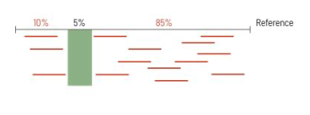
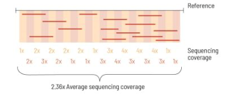

**Namespaces**: Act as containers to group related code and prevent naming collisions. They are a declarative region thath provides a scope for identifiers (e.g., classess, variables, functions) and allow to organize code into logical categories and avoid name clashed when dealing with large codebases or multiple libraries.

**Module directives**: e.g., `import`, `using`. Statements used to import / esport code across different files and modules.  

---

* **Quality string**: GIves the base-bu-base confidence of the sequencer's calls
* A → ASCII 65 → Q = 32
* F → ASCII 70 → Q = 37
* K → ASCII 75 → Q = 42

ASCII-encoded **Phred quality scores**: Higher scores = higher confidence

$$Q=\frac{-10}{\log_{10}(p)}$$

* $Q20 \rightarrow 1$% error
* $Q30 \rightarrow 0.1$% error
* $Q40 \rightarrow 0.01$% error

Used for:
- QC assessment
- Timming low-quality ends
- filtering poor reads
- helping aligners weigh confidence

---
**Wild card**: Placeholder mechanism used to generalize rules and target specifications which allow single set of workflow logic to process multiple input files or output names without needing separate code definitions

---

**Adapter contamination**: when a sequencing read contains part of the synthetic adapter sequence that was added during klibrary preparation (instead of only biological sequence from the sample). Occurs when DNA/RNA fragment is shorter than the read length so the sequencer reads through the real insert and into the adapter on the end. It can also happen it the adapter dimerizes or if poorly size-selected fragments get sequenced.

- Adapter contamination can reduce alignment rates and increase mismatches
- Can distort downstream analyses
- Often appear as rising adapter content signal toward 3-prime end of reads

Illumina adapter carryover e.g., `GATCGGAAGAGCACACGTCTGAACTCCAGTCACAGTCAAATCTCGTATGC`

homopolymer-rich sequences e.g.,
`CCCCCCCCTTTTTTTTTTTTTTTTTTTTTTTTTTTTTTTTTTTTTTTTTT`

---

### Alignment-based quantification 
**Tools**:
- `STAR`: Commonly used: fast and performrs well for splice aware alignmenmt
- `HISAT2`

e.g.,

```
trimmed FASTQ
    ↓
STAR alignment to reference genome
    ↓
BAM file
    ↓
alignment QC
    ↓
gene-level counting
```

```
STAR --genomeDir STAR_index \
     --readFilesIn sample_trimmed.fastq.gz \
     --outSAMtype BAM SortedByCoordinate \
     --outFileNamePrefix sample_
```

### Lightweight transcript quantification
**Tools**:
- `Salmon`
- `Kallisto`

e.g., 
```
trimmed FASTQ
    ↓
Salmon quantification against transcriptome
    ↓
transcript-level abundance estimates
    ↓
gene-level summarization with tximport
    ↓
DESeq2 / edgeR / limma-voom
```

Forward: `--libType SF`

Reverse: `--libType SR`

---

Single-end RNA-seq = sequencer reads only one end of each cDNA fragment:

```
RNA fragment / cDNA fragment:
5' ----------------------------- 3'

Single-end sequencing:
READ →
5' -----> 
```
  * Lower mapping confidence
  * Lower isoform/splice-junction resolution
  * Weaker fusion detection
  * Gene-level differentiation expression is fine (same for paired-end sequencing)

Paired-end sequencing = both ends of the same fragment are sequenced:

```
Paired-end sequencing:
READ 1 →                 ← READ 2
5' ----->             <----- 3'
```

  * Higher mappoing confidence
  * Higher isoform/splice-junction resolution
  * Better fusion detection

Stranded-RNA-seq lets aligner interpret whether a read supports gene on the same strand or the opposite strand

---

**Lane**:Physical sequencing lane on Illumina flow cell. A single biological sample library is often split across multiple lanes to get more depth and balance the run:

e.g., 
```
genelab/extracted_rnaseq/C-FLT-4/C-FLT-4_S62_L005_R1_001.fastq.gz
genelab/extracted_rnaseq/C-FLT-4/C-FLT-4_S62_L006_R1_001.fastq.gz
genelab/extracted_rnaseq/C-FLT-4/C-FLT-4_S62_L007_R1_001.fastq.gz 
```

---

1. Build HIST2 genome index
2. Merge trimmed lane FASTQs into FASTQ per biological sample before alignment
3. Alignment:

e.g Output., 

* `C-Ba-1.hisat2.summary.txt`: $35,633,737$ input reads
* $29,943,499$ reads ($84.03$%) aligned *once*
* $5,164,864$ reads ($14.49$%), aligned once (multimapping)
* Only $525,374$ reads ($1.47$) failed to align
* Overall alignment rate $=98.53$%

- In short-read single-end RNA-seq, especially at 50 bp, some reads will end up ambiguously in repetitive regions, gene families, pseudogenes, low-complexity sequence (common with 50bp)
  - Mouse transcriptomes contain repetitive and homologous regions
  - `525374 (1.47%) aligned 0 times` Little leftover contamination, adapter artifact, major reference mismatch

---

`-U` Single-end reads

`--rna-strandness R` Dataset is reverse-stranded

---

4. Feature count: Count single-end reads against Ensembl exon features and summariz them to genes

* Assigned counts: $25.8M$ to $30.7M$ (assigned fractions: $56.3$% and $58.1$%)
* Default option: not count multiparameters
* Wrong strands settings would drop instead of clustering around same value in every BAM.
* Short reads are more likely to match multiple loci, paralogs, repeats, pseudogenes, or homologous transcript regions
* Samples such as `C-FLT-4` have more assignedm reads because they're deeper libraries

5. Normalization

* Normalization in DESeq2: Accounts for sequencing depth and library composition $\rightarrow$ ensure gene expression levels are comparable across samples.
  * Geometric average is calculated with logs
  * Filter out `infinity` $\rightarrow$ Helps focus scaling factors on house keeping genes - scaling factors are based only on 'stable' genes that aren't jumping between 0 and high expression. Once scaling factors are determined they are then applied to **all** genes including tissue-specific ones
  * Substract average log value from `log(counts)` $\rightarrow$ Ratio reads in each sample to avg. across all samples
  
6. Calculate median of ratios for each sample (avoids large/outliers taking over)

* DESeq2 and EdgeR are both based on negative bionomial modeling
  * EdgeR better at analyzing genes with low expression counts (dispersion estimation captures variability in t he *sparse* count data). 

---

Multicellular program = Coordinated gene-expression pattern shared across multiple interacting cell types in a tissue, organoid, tumor, developmental system.

---

### Proteomics

* Thermo Fisher instruments produce `.raw`
  * contents:
    * spectra
    * scan metadata
    * chromatographic information
    * precursor/fragment ion information
    * instrument settings
* `.raw` $\rightarrow$ `.mzML`

`.mzML` $\rightarrow$ Fragpipe

---

## Single `snakefile` vs. Multiple `smk` Modules 

* Single `Snakefile`:
  * Simple to read and track
  * Best for small pipelines (e.g., $< 50$ rules)
  * Low reusability since copy-pasting may be required

* Multiple `.smk` Modules
  * e.g., $50+$ rules
  * High reusability since rules can be imported / shared
---

### 

- **Optical swath**: strip-like imaging region of an Illumina flow cell that is scanned by the sequencer's optics.

```
flow cell
  → lane
    → surface
      → swath
        → tile

2216
││└─ tile 16
│└── swath 2
└─── surface 2

-----------------------

Surface 1, Lane X

┌──────────────────────────────┐
│ Swath 1: tiles 1101–1128     │
├──────────────────────────────┤
│ Swath 2: tiles 1201–1228     │
└──────────────────────────────┘

------------------------

Surface 2, Lane X

┌──────────────────────────────┐
│ Swath 1: tiles 2101–2128     │
├──────────────────────────────┤
│ Swath 2: tiles 2201–2228     │
└──────────────────────────────┘

```

- **Bismark conversion**: Quality control statistics metrics that estimate how efficiently the bisulfide treatment converted unmethylated cytosined into thymines.

$$conversion.rate=\frac{converted.methylated.Cs}{total.unmethylated.Cs}$$

  - $>99 \% \rightarrow$ Excellent

  - $<95 \% \rightarrow$ Potential problems 


---

"Total Sequences" contain only the read count, it doesn't account for:
* Read length
* Alignment rate
* Duplicate removal 
* Trimming
* OVerlapping paired-end reads
* Genome/target size
* 
**Coverage**: Describes percentage of genome / target region that is sequenced to a certain threshold. ***How much of the target region is covered at least once***. It can be influenced by:

- Quality of DNA sample
- Library preparation
- Sequencing bias
- High GC content 
- Repetitive elements

**Sequencing depth**: Describes how often a specific base in the reference is read during the sequencing process. ***Numberm of times a nucleotide is read during the sequencing process***. Can be affected by:

- Accuracy of genome alignment algorithms
- Uniqueness of sequencing reads
- How well they can be mapped to the target genome

<div style="display: grid; grid-template-columns: repeat(2, minmax(0, 1fr)); gap: 1rem; align-items: start;">
  <div>
    <p><strong>Coverage</strong></p>
    
  </div>
  <div>
    <p><strong>Depth</strong></p>
    
  </div>
</div>

[Source](https://cegat.com/depth-and-coverage-what-is-the-difference/)

---

Fewer `Total Sequences` does not automatically mean poor coverage. Depth depends on:

$usable\_reads$ = raw_reads * alignment_rate * (1-duplicate_fraction) * other_filtering_fractions

**They do may imply:**
* Lower potential sequencing depth
* Fewer aligned reads
* Lower statistical power
* Less reliable measurements in low-signal regions